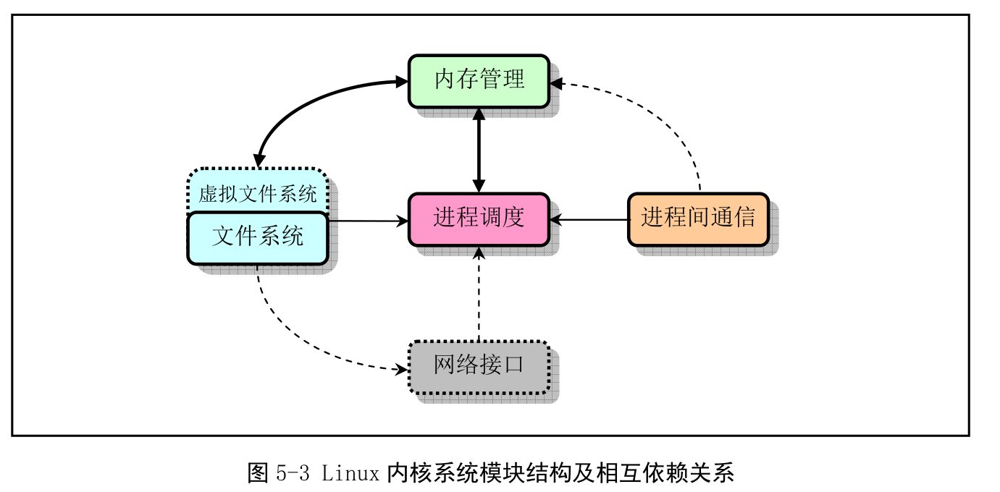
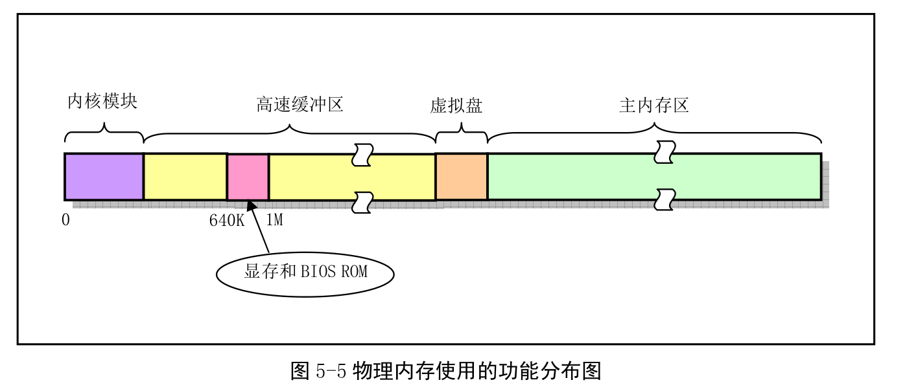
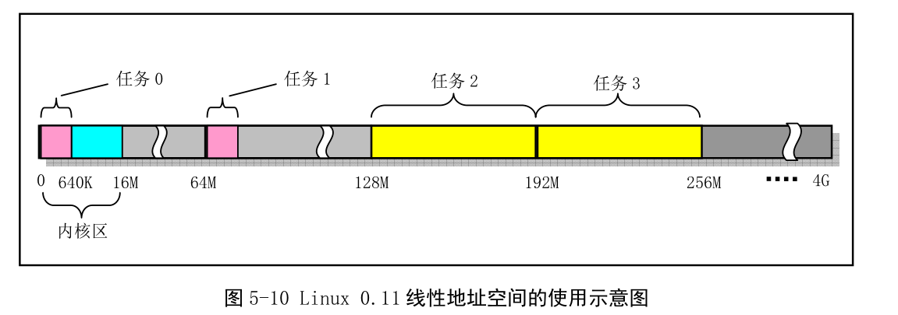
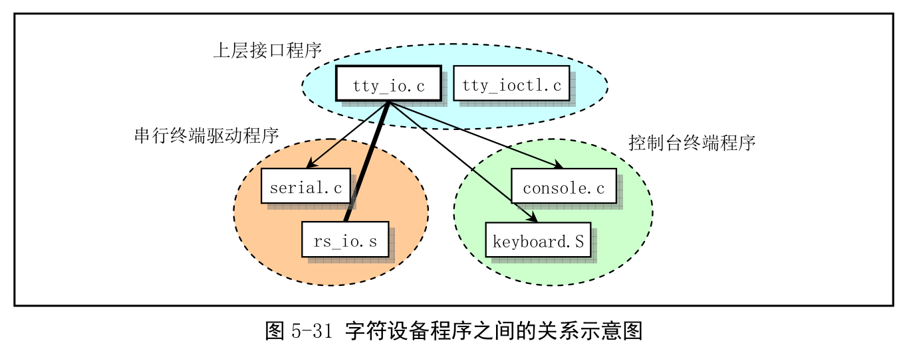

# 第五章 Linux内核体系结构
## 内核模式

## 内核体系结构
    模块：
    1. 进程调度模块
    2. 内存管理模块
    3. 文件系统模块
    4. 进程间通信模块
    5. 网络接口模块

## 内存管理和使用
### 物理内存

***
    当一个进程需要读取块设备的数据时，系统会先把数据读取到高速缓冲区。当有数据要写入到块设备时，也是先写入到高速缓冲区，然后再由块设备驱动写入到块设备中。
    在内存中仅仅最后部分的主内存区才是供所有程序可以分配使用的内存区域。
### 内存地址空间概念
    内存地址的分类：
    1. 程序的虚拟和逻辑地址
        虚拟地址是指程序产生的由段选择符和段内偏移地址两个部分组成的地址。需要通过分段地址变换机制处理或映射后才对应到物理地址上。
        逻辑地址是指程序产生的与段相关的偏移地址部分。
    2. CPU的线性地址
        虚拟地址到物理地址的中间层，是处理器可寻址的内存空间中的地址。如果启用了分页机制，那么线性地址可以再经过变换得到物理地址，如果没有开启分页机制，那么线性地址就是物理地址。
    3. 实际物理内存地址
### 内存分段机制

***
    在对一个地址进行寻址的时候，如果要寻找的地址在本段内，那么可以直接使用线性地址找到所需要的地址，如果不在本段内，那么需要先找到段描述符，然后根据段描述符里面的偏移地址，再跳转到该段，使用线性地址得到最终的物理地址。

***
    程序的逻辑地址用于寻找段和段中具体的位置
    内核的代码段和数据段是重叠的，各个任务的代码段和数据段也是重叠的。
    一个进程的所有代码，数据和堆栈部分都处于一块内存段中
### 内存分页机制
    内存分页机制的基本原理是将CPU整个线性内存区域分为4096字节的一页的内存空间
    在Linux0.11中所有的段空间都是64mb，也就是所有的任务的段的开始位置都是64mb的整数倍。

***
    CPU中分段机制中段的概念确定了线性地址中一个段的用途以及被执行或访问的约束和限制。
    每个段都可以设置在4GB内存的任意位置，可以相互独立也可以相互重叠也可以部分重叠。

### 多任务和保护方式
    CPU分为四个保护级别。
    内核代码本身由系统中所有的任务共享，每个任务都有自己的代码段和数据段，这部分是处于局部空间的，其他任务不可见。

### 虚拟地址、线性地址和物理地址的对应关系
#### 内核代码和数据的地址

### 任务0的地址对应关系

### 任务1的地址对应关系

### 其他任务地址对应关系

## Linux中断机制
### 中断操作原理
    可编程中断控制器（PIC）是中断请求的管理者
    设备激活中断请求IRQ--->PIC会检测到--->当同一时间收到多个IRQ时会进行优先级比较--->向处理器发起请求
### 中断向量表
    在BIOS阶段初始化中断号，
    对于Linux系统而言，除了在开始的阶段会使用BIOS提供的中断来进行操作，在内核正常工作后会重新初始化一个向量表
### Linux内核中断处理
    在设置中断描述符IDT时，Linux使用了中断门和陷阱门两种描述符，中断门会复位IF标志，防止其他中断来打断该中断的处理。
### 标志寄存器的中断标志
    cli和sti:
        cli用于复位中断标志，cli指令之后系统会不响应外部中断（那么有没有内部中断呢？）
        sti表示允许响应中断

## Linux系统调用

***
    在Linux内核中，每个系统调用都具有一个唯一的系统调用功能号，定义在include/unistd.h中
    而这些功能号对应着include/linux/sys.h中的sys_call_table[]中的索引值
### 系统调用过程
    库函数向内核发出中断调用int 0x80--->eax寄存器存放系统调用号--->处理中断Int 0x80(kernel/system_call.s中的system_call)
    在每个系统调用的处理函数中会对传递的参数进行验证，确保参数是合法有效的
## 系统时间和定时
### 系统时间
    为了准确的获取时间，微机使用电池供电的RT电路支持，并且与少量的CMOS RAM集成在一块芯片上。
    开机时，通过time_init()函数读取这块芯片的内容，并转换为timestamps格式。
    jiffies:系统开机启动开始计数的系统滴答值。每个滴答的时值是10ms
    #define CURRENT_TIME (startup_time+jiffies/HZ)	// 当前时间（秒数）。
### 系统定时
    系统每隔10ms会发出一个时钟中断请求。因此一个滴答也就是一个时钟周期
    Linux内核定时器最多可以使用64个
## 进程控制
    Linux0.11最多64个进程
    Linux进程可以在内核态和用户态执行，并且分别使用各自独立的内核态堆栈和用户态堆栈，用户态堆栈临时保存调用函数的参数和局部变量等，内核堆栈保存内核程序执行函数调用时的信息。
    Linux中进程也称作task
### 任务数据结构

### 进程初始化
    内核初始化内存管理、中断处理、进程管理等模块后--->move_to_user_mode()(只是移动设置好用户的特权模式，但是程序结构没有发生变化)（进程0）--->fork()创造出进程1--->进程1执行应用环境的初始化并执行shell登陆程序（进程0只是执行pause，并没有被注销）
## Linux中的堆栈使用方法
    堆栈分类：
    1. 引导初始化时使用的临时堆栈
    2. 进入保护模式之后提供内核程序初始化使用的堆栈，也就是后来任务0使用的堆栈
    3. 通过系统调用执行内核程序使用的堆栈
    4. 用户态执行自己程序的堆栈

## Linux0.11采用的文件系统

***
    Linux0.11内核所支持的文件系统是Minux 1.0文件系统
## Linux内核源代码的目录结构

### boot目录
    是内核源代码最先被编译的程序，主要完成计算机加电时引导启动，将内核代码加载到内存中
    bootsect.s:磁盘引导程序，编译后将驻留在磁盘的第一个扇区。
    setup.s:主要用于读取机器的硬件配置参数，并把内核模块system移动到适当的内存位置处。
    head.s:程序会编译连接在system模块的最前部分，主要进行硬盘设备的推测设置和内存管理页面的初始设置工作
### 文件系统目录fs

### 内核程序主目录kernel

### 块设备驱动程序子目录

### 字符设备驱动程序子目录

