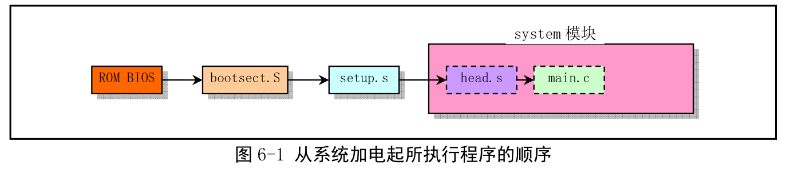

# 第六章 引导驱动程序
## 总体功能

## bootsect.s程序
### 功能描述
    bootsect.s代码是磁盘引导块程序，驻留在磁盘的第一个扇区
    该程序的主要功能就是把磁盘第二个扇区到第四个扇区的setup模块，加载到内存紧接bootsect后面位置处。

### 硬盘设备编号
    设备号=主设备号*256+次设备号
    主设备号
    1. --->内存
    2. --->磁盘
    3. --->硬盘
    4. --->ttyx
    5. --->ttys
    6. --->并行口
    7. --->串行口
## setup.s程序
    主要作用是利用ROM BIOS中断读取机器系统数据，并保存到0x90000开始的位置(也就是bootesect的加载位置，覆盖bootsect)
    为了能够让head.s在32位模式下运行，setup.s设置了临时的中断描述符(IDT)和全局描述符(GDT),并在GDT中设置了当前内核代码的描述符和数据描述符。在head.s中会重新设置这些描述符。

## head.s程序
    head.s程序在编译后会和内核其他程序一起被连接成system模块，位于system模块的最开始的部分。
    从head.s开始，内核完全都是在保护模式下工作
    程序是处于内存绝对地址0处开始的地方
    1. 加载各个数据段寄存器
    2. 重新设置中断描述符IDT，总共256项，并使各个表项均指向一个只报错误的哑中断子程序（ignore_int）
    3. 重新设置GDT，实际上重新设置的GDT和setup设置的GDT除了在段限长上有区别（原来为8mb,现在设置为16mb）,其他内容一致。
    4. 设置管理内存的分页处理机制，将页目录放置在绝对物理地址0开始处
    5. 最后返回指令将预先放置在堆栈里面的/init/main.c程序的入口地址弹出，去运行main.c程序

