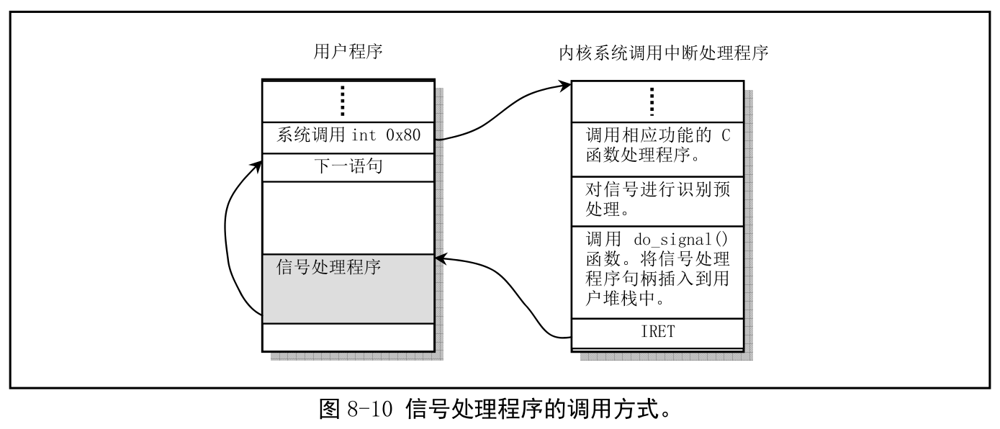

# 第八章 内核代码(kernel)
## 总体功能
    kernel目录下面的代码主要分为三类
    1. 硬件中断处理程序文件
    2. 系统调用服务处理程序文件
    3. 进程调度等通用功能文件

### 中断处理程序

### 系统调用处理相关程序
    sys_xxx()函数都是相应系统调用所需调用的处理函数，有部分是使用汇编语言实现的。
    以do_xxx()开始的是中断处理过程中调用的C函数
### 其他通用类程序
    schedule.c mktime.c panic.c printk.c

## asm.s程序

## trap.c程序
    底层代码asm.s文件中调用的相对应的C函数，用于显示调错信息

## system_call.s
### 功能描述
    在Linux0.11中，用户使用中断调用int 0x80和寄存器eax中的功能号来使用内核提供的各种服务
    内核按照系统调用功能号顺序排列成为一张函数指针表(include/linux/sys.h)
    然后在中断int 0x80的处理过程中根据用户提供的功能号调用函数进行处理
    本程序主要实现系统调用中断int 0x80的入口处理过程以及信号检测处理,同时给出两个系统调用的底层接口(sys_execve和sys_fork)

### 添加系统调用
    除了ioctl是一个系统调用实现多个功能，其他都是一个系统调用实现一个功能
    实现流程：
    1. 在sys.c中创建处理函数（BH）
    2. 在include/unistd.h中添加新系统调用的调用功能号和函数原型的定义
    3. 在include/linux/sys.h中sys_call_table中添加新系统调用处理函数的函数名
    4. 最后修改system_call.s的61行，修改内核系统调用的总数

## mktime.c
    和C库的mktime函数功能一样，转换为unixtime
## sched.c
### 功能描述
    schedule()函数负责选择系统中下一个要运行的进程
    调用过程：
    1. 对所有任务进行检测，唤醒任何一个已经得到信号的任务
    2. *p代表的是等待队列的头指针，tmp是建立在函数堆栈上的临时指针，current是当前任务指针

## signal.c程序
### 功能描述
    在unix中，信号机制是一直软件中断的处理机制
    信号处理机制在unix时就有了，但是早期的unix内核中信号处理的方法并不是那么可靠的，信号可能会丢失。
    进程对信号的处理方式
        1. 忽略该信号，大多数信号都是被忽略的，除了SIGKILL和SIGSTOP
        2. 捕获该信号，首先得告诉内核在指定的信号发生的时候调用我们自定义的函数来进行处理
        3. 执行默认操作
    该程序主要处理sys_ssetmask()和sys_sgetmask(),sys_signal()(传统信号处理函数signal()),sys_sigaction()
    signale和sigaction的功能都比较类似，都是更改信号源处理句柄(handler),但是传统的信号处理方式，可能在某些时刻会发生丢失
    signal的不可靠在于，每次处理都需要进行signal的重新设置，但是也有可能在处理信号的这个阶段就来了该信号的数据，这样就会导致该信号丢失。

## exit.c程序
### 功能描述
    主要处理进程的终止和退出的相关事宜。主要包括进程的释放，会话终止、程序退出函数以及杀死进程、终止进程、挂起进程等系统调用
## fork.c程序
### 功能描述
    sys_fork()系统调用主要是使用两个C函数find_empty_process()和copy_process()还包括内存区域验证与内存分配函数verify_area()和copy_mem()
    copy_process():主要负责复制进程的代码段和数据段以及环境

## sys.c程序

