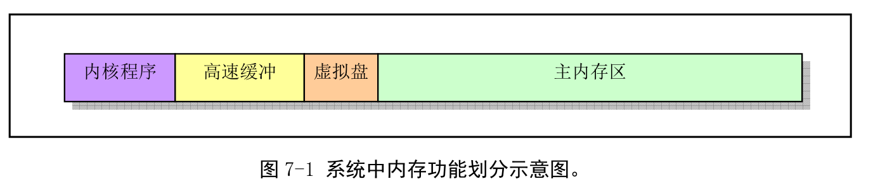
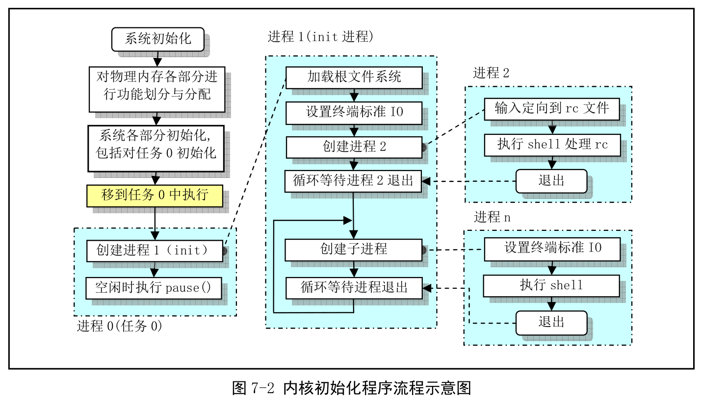
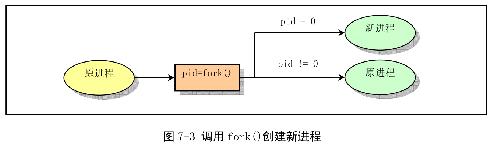
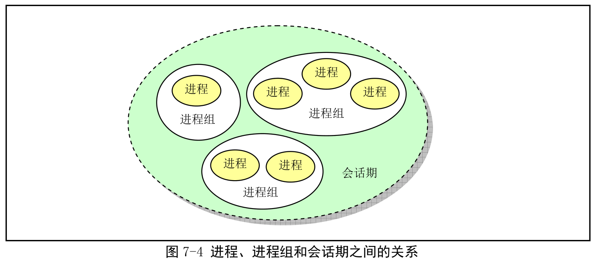

# 第七章 初始化程序init
    init目录只包含一个main.c，包含了内核初始化的所有工作
## main.c程序
### 功能描述

***
    main.c首先会确定如何分配内存，然后调用内核各部分的初始化函数对内存管理、中断处理、块设备、字符设备、进程管理等进行初始化后，系统各部分已经处于可以运行的状态了---->手动移动到任务0中运行---->使用fork()调用首次创建处进程1(init进程)
    原始进程0会在系统空闲的时候被调度执行，因此进程0也被称为是idle进程，此时进程0只是执行pause系统调用，而不会调度函数
    init函数功能：
    1. 安装根文件系统
       1. 首先调用setup系统调用，收集硬盘分区表信息，并安装根文件系统，在安装根文件系统时候系统会先判断是否需要建立虚拟盘
    2. 显示系统信息
       1. 打开一个终端设备tty0,并复制文件描述符以产生标准输入标准输出和标准错误输出
    3. 运行系统初始资源配置文件rc中的命令
    4. 执行用户登录的shell程序

### 其他信息
#### CMOS信息
    CMOS信息通常是系统实时时钟芯片(RTC)的一部分
    CMOS的地址空间在基本内存空间之外，因此不包括执行代码
    要访问它需要通过端口0x70,0x71进行
#### fork()创建进程
    fork是一个系统调用，该系统调用复制当前进程，并在进程表中创建一个与原进程几乎完全一样的新表项，并执行同样的代码，但是该新进程拥有自己的数据空间和环境参数。

#### session的概念
    进程组是一个或者多个进程的集合，每个进程组都有一个唯一的进程组ID(gid)来标识。
    session则是一个或者多个进程组的集合，通常一个用户登录后的所执行的所有程序都是属于一个session

## 环境初始化工作
    在内核系统初始化之后，系统还需要根据具体的配置执行进一步的初始化的工作
    init进程的主要任务是根据/etc/rc文件中的配置的信息，执行其中的设置的命令，然后根据/etc/inittab文件中的信息，为每个允许登录的终端设备使用fork创建一个子进程，然后Init自己调用wait

