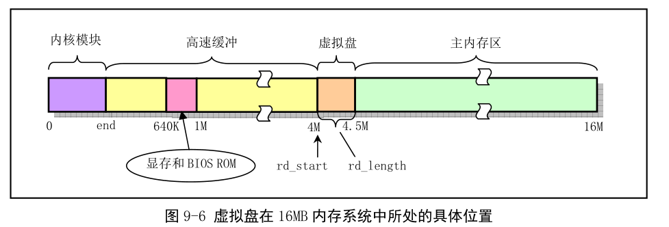

# 第九章 块设备驱动程序
## 总体功能
    对于硬盘和软盘块设备上数据的读写是通过中断处理程序进行的，内核每次读写的数据量是以一个逻辑块(1024字节)为单位的。而块设备的读取是以一个扇区为单位（512字节）的。使用读写请求项等待队列来顺序缓冲一次读写多个逻辑快的操作
### 块设备请求项和请求队列
    对于各种块设备内核使用一张块设备表blk_dev[]来进行管理，每种块设备在块设备表中都占用一项
```c
// 块设备结构。
struct blk_dev_struct
{
  void (*request_fn) (void);	// 请求操作的函数指针。
  struct request *current_request;	// 请求信息结构。
};

// 下面是请求队列中项的结构。其中如果dev=-1，则表示该项没有被使用。
struct request
{
  int dev;			/* -1 if no request */// 使用的设备号。
  int cmd;			/* READ or WRITE */// 命令(READ 或WRITE)。
  int errors;			//操作时产生的错误次数。
  unsigned long sector;		// 起始扇区。(1 块=2 扇区)
  unsigned long nr_sectors;	// 读/写扇区数。
  char *buffer;			// 数据缓冲区。
  struct task_struct *waiting;	// 任务等待操作执行完成的地方。
  struct buffer_head *bh;	// 缓冲区头指针(include/linux/fs.h,68)。
  struct request *next;		// 指向下一请求项。
};

```


***
    当块设备有好几个请求项组成的链表的时候，就会根据电梯算法来把新建的项插入到对应的位置。
    内核并非按照接收到请求项就开始进行块设备的处理，而是按照请求项的顺序进行排序后再进行块设备的处理操作。

## hd.c程序
    sys_setup()函数利用boot/setup.s中提供的信息对系统中所含硬盘驱动器的参数进行设置，然后读取硬盘分区表，并尝试把启动引导盘的虚拟根文件系统映像文件复制到内存虚拟盘中。
    hd_init()函数主要用于内核初始化时设置硬盘控制器中断描述符，并复位硬盘控制器中断屏蔽码，用以允许硬盘控制器发送中断请求信号。
    hd_out()函数是硬盘控制器操作命令发送函数
    do_hd_request()函数是硬盘请求项的操作函数


## ll_rw_blk.c程序
### 功能描述
    该程序主要用于执行底层块设备读写操作。
    ll_rw_block()函数主要用于为块设备创建块设备的读写请求项，并插入到设备请求队列中，实际的读写操作则由设备的请求项处理函数request_fn()完成，对于硬盘最后执行的是do_hd_request()函数来执行。
    request_fn()函数最后都会通过C函数(read_intr或者write_intr来返回中断)

## ramdisk.c程序
### 功能描述
    本文件是内存虚拟盘驱动程序，虚拟盘是利用物理内存来模拟磁盘存储数据的方式，主要是为了提高对数据的读写操作速度。
    当在Makefile文件中定义了常量RAMDISK，内核初始化的时候就会在内存中划处一段内存来用于存放虚拟盘数据。

