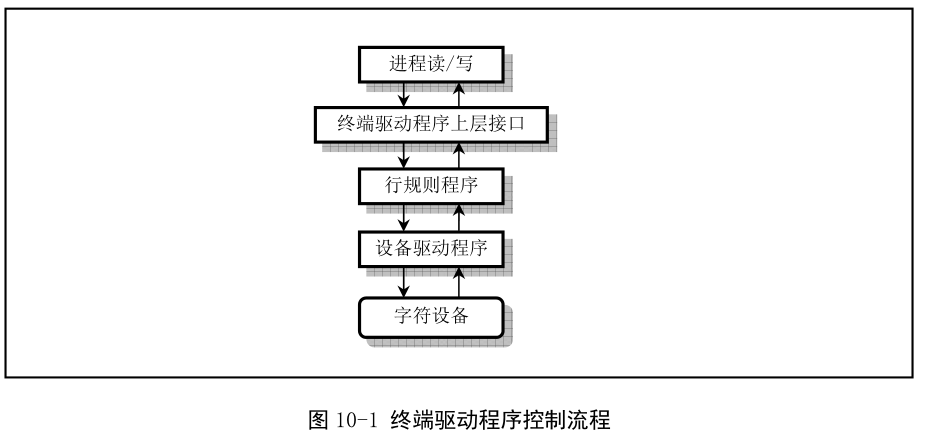
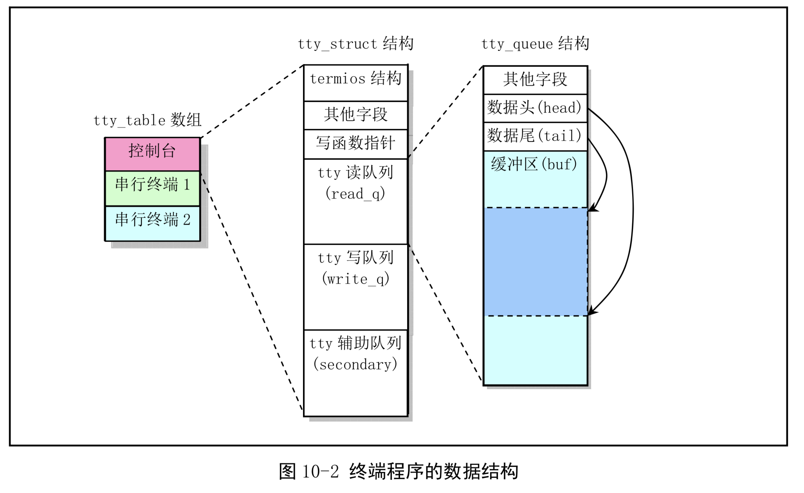
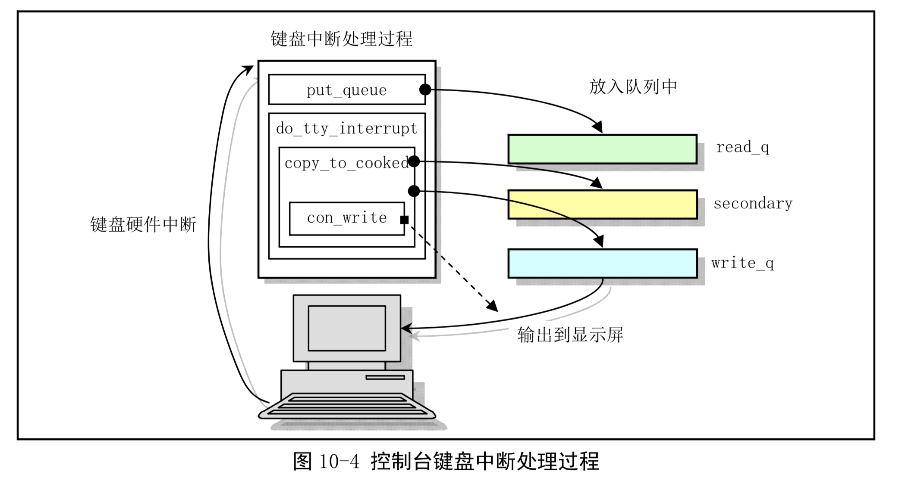
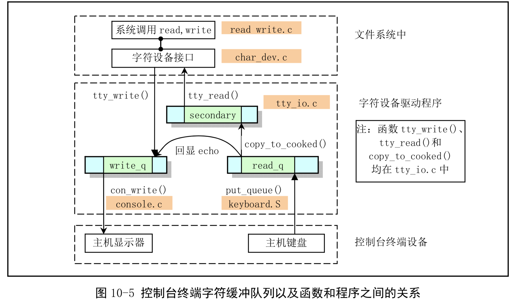
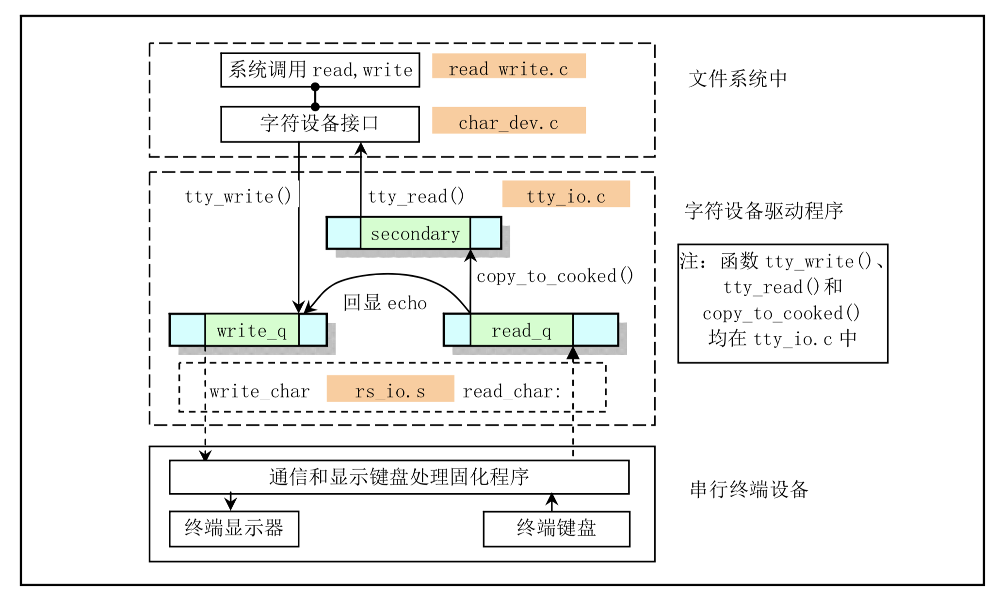
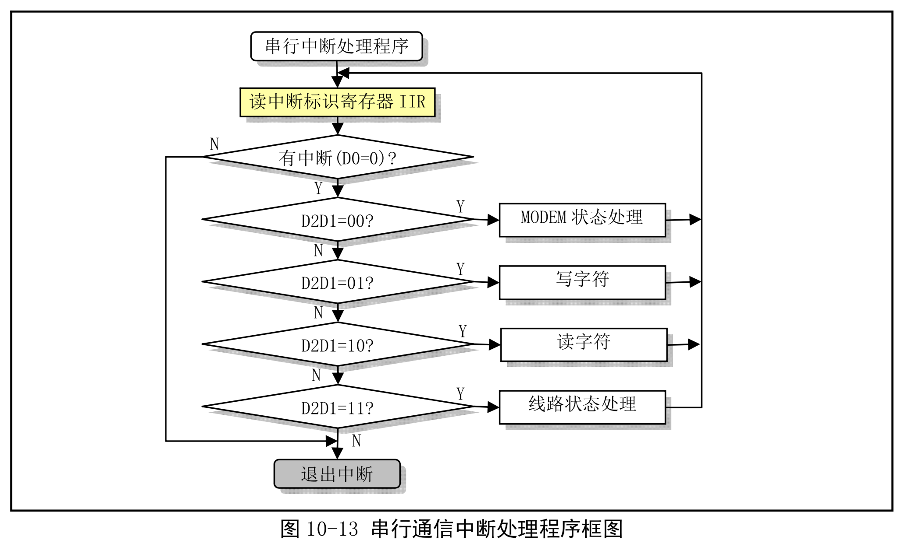

# 第十章 字符设备驱动程序
## 总体功能
### 终端驱动程序基本原理

```c
// tty 数据结构。
struct tty_struct
{
  struct termios termios;	// 终端io 属性和控制字符数据结构。
  int pgrp;			// 所属进程组。
  int stopped;			// 停止标志。
  void (*write) (struct tty_struct * tty);	// tty 写函数指针。
  struct tty_queue read_q;	// tty 读队列。
  struct tty_queue write_q;	// tty 写队列。
  struct tty_queue secondary;	// tty 辅助队列(存放规范模式字符序列)，
};				// 可称为规范(熟)模式队列。
//使用tty的数组来保存每个终端设备的信息
extern struct tty_struct tty_table[];	// tty 结构数组。

//终端所处理的数据被保存在3个tty_queue结构的缓存队列中
// tty 等待队列数据结构。
struct tty_queue
{
  unsigned long data;		// 等待队列缓冲区中当前数据指针字符数[??]）。
// 对于串口终端，则存放串行端口地址。
  unsigned long head;		// 缓冲区中数据头指针。
  unsigned long tail;		// 缓冲区中数据尾指针。
  struct task_struct *proc_list;	// 等待进程列表。
  char buf[TTY_BUF_SIZE];	// 队列的缓冲区。
};


``` 




 