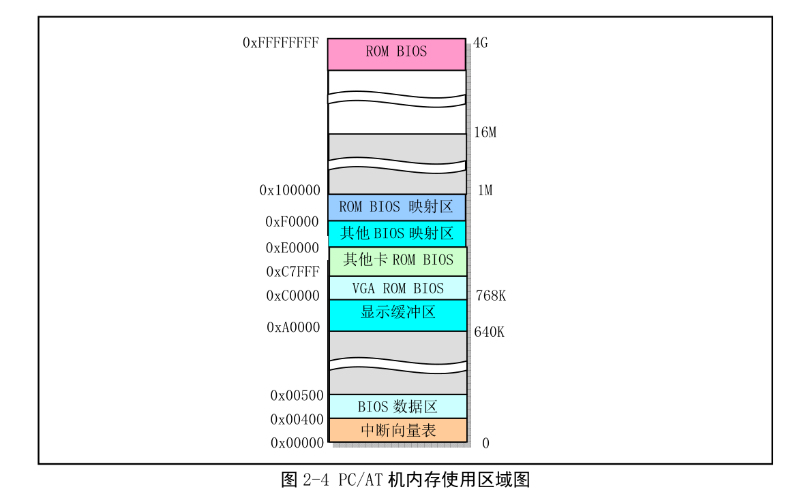

# 第二章 计算机组成结构
## 组成原理

***
    CPU通过总线来和计算机的其他部分进行数据通信(数据总线、控制总线、地址总线（总称内部总线）)
    1. 控制卡通过扩展插槽和系统总线连接
    2. 但是现代的计算机架构都是通过集成的芯片来进行控制

## IO端口寻址和访问控制方式
    1. CPU为了访问IO接口的控制器的状态信息就需要知道他们的地址
    2.一个IO控制器包括访问数据的数据端口、输出命令的命令端口和访问控制器的执行状态的状态端口。
    端口地址的设置方式：
        1. 统一编址
           1. 把IO端口的地址纳入到寄存器的寻址范围
           2. 可以使用访问内存的方式直接访问
        2. 独立编址
           1. 采用一个独立的地址空间来进行编址
     3. 在Linux中输入cat /proc/ioports可以看到相关控制器或设置使用的IO地址范围
```shell
tang@tang-VirtualBox:~/Learn/linux-0.11-lab$ cat /proc/ioports  
0000-0000 : PCI Bus 0000:00                                     
  0000-0000 : dma1                                              
  0000-0000 : pic1                                              
  0000-0000 : timer0                                            
  0000-0000 : timer1                                            
  0000-0000 : keyboard                                          
  0000-0000 : keyboard                                          
  0000-0000 : rtc_cmos                                          
    0000-0000 : rtc0                                            
  0000-0000 : dma page reg                                      
  0000-0000 : pic2                                              
  0000-0000 : dma2                                              
  0000-0000 : fpu                                               
  0000-0000 : 0000:00:01.1                                      
    0000-0000 : ata_piix                                        
  0000-0000 : 0000:00:01.1                                      
    0000-0000 : ata_piix                                        
  0000-0000 : 0000:00:01.1                                      
    0000-0000 : ata_piix                                        
  0000-0000 : vga+                                              
  0000-0000 : 0000:00:01.1                                      
    0000-0000 : ata_piix                                        
0000-0000 : PCI conf1                                           
0000-0000 : PCI Bus 0000:00                                     
  0000-0000 : 0000:00:07.0                                      
    0000-0000 : ACPI PM1a_EVT_BLK                               
    0000-0000 : ACPI PM1a_CNT_BLK                               
    0000-0000 : ACPI PM_TMR                                     
    0000-0000 : ACPI GPE0_BLK                                   
  0000-0000 : 0000:00:07.0                                      
    0000-0000 : piix4_smbus                                     
  0000-0000 : 0000:00:01.1                                      
    0000-0000 : ata_piix                                        
  0000-0000 : 0000:00:02.0                                      
    0000-0000 : vmwgfx probe                                    
  0000-0000 : 0000:00:03.0                                      
    0000-0000 : e1000                                           
  0000-0000 : 0000:00:04.0                                      
  0000-0000 : 0000:00:05.0                                      
    0000-0000 : Intel 82801AA-ICH                               
  0000-0000 : 0000:00:05.0                                      
    0000-0000 : Intel 82801AA-ICH                               
  0000-0000 : 0000:00:0d.0                                      
    0000-0000 : ahci                                            
```
### 接口控制访问
    1. 程序循环查询
    2. 中断处理方式
    3. DMA方式
## 主存储器、BIOS、CMOS存储器
### 主存储器

### BIOS
    存放在ROM的系统BIOS程序主要用于开机时进行系统各部分的自检，建立操作系统需要的各种配置表
    BIOS提供的这些服务不具备可重入性
    Linux在运行时不使用BIOS中的功能（那么这么获取BIOS的信息呢？）
#### 开机引导过程
    开机后CPU自动把CS设置为0xF000,其基地址为0xFFFF0000,段长度设置为64kb,而IP设置为0xFFF0

### CMOS
    除了内存、ROM和BIOS以外，还使用少量存储容器CMOS，通常和时钟芯片集成一块，存放实时的时钟信息和系统硬件配置信息
    CMOS内存地址在地址空间的基本地址之外，需要使用IO指令来访问
## 控制器和控制卡s
### 中断控制器
    ROM里面的BIOS会对中断控制器的芯片进行初始化，并在0x000-0xFFF区域建立中断向量表。
    但是Linux默认不直接使用这些设置好的中断向量表，在LInux系统执行初始化操作时，会重新设置中断请求号与中断向量表的对应关系。
### DMA控制器
    通过外部设备直接与内存进行传输数据来增强系统的性能
### 定时/计数器
### 串行控制卡
    1. 异步串行通信原理
       1. 分类：
          1. 异步串行通信
             1. 以一个字符作为一帧或者一个通信单位进行传输的
          2. 同步串行通信
             1. 以多个字符作为一帧或者一个通信单位

