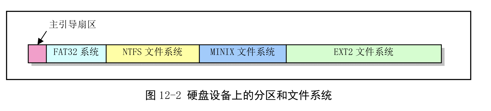

# 第十二章 文件系统
## 总体功能


```c
// 内存中磁盘超级块结构。
struct super_block
{
  unsigned short s_ninodes;	// 节点数。
  unsigned short s_nzones;	// 逻辑块数。
  unsigned short s_imap_blocks;	// i 节点位图所占用的数据块数。
  unsigned short s_zmap_blocks;	// 逻辑块位图所占用的数据块数。
  unsigned short s_firstdatazone;	// 第一个数据逻辑块号。
  unsigned short s_log_zone_size;	// log(数据块数/逻辑块)。（以2 为底）。
  unsigned long s_max_size;	// 文件最大长度。
  unsigned short s_magic;	// 文件系统魔数。
/* These are only in memory */
  struct buffer_head *s_imap[8];	// i 节点位图缓冲块指针数组(占用8 块，可表示64M)。
  struct buffer_head *s_zmap[8];	// 逻辑块位图缓冲块指针数组（占用8 块）。
  unsigned short s_dev;		// 超级块所在的设备号。
  struct m_inode *s_isup;	// 被安装的文件系统根目录的i 节点。(isup-super i)
  struct m_inode *s_imount;	// 被安装到的i 节点。
  unsigned long s_time;		// 修改时间。
  struct task_struct *s_wait;	// 等待该超级块的进程。
  unsigned char s_lock;		// 被锁定标志。
  unsigned char s_rd_only;	// 只读标志。
  unsigned char s_dirt;		// 已修改(脏)标志。
};
// 内存中磁盘超级块结构。
struct super_block
{
  unsigned short s_ninodes;	// 节点数。
  unsigned short s_nzones;	// 逻辑块数。
  unsigned short s_imap_blocks;	// i 节点位图所占用的数据块数。
  unsigned short s_zmap_blocks;	// 逻辑块位图所占用的数据块数。
  unsigned short s_firstdatazone;	// 第一个数据逻辑块号。
  unsigned short s_log_zone_size;	// log(数据块数/逻辑块)。（以2 为底）。
  unsigned long s_max_size;	// 文件最大长度。
  unsigned short s_magic;	// 文件系统魔数。
/* These are only in memory */
  struct buffer_head *s_imap[8];	// i 节点位图缓冲块指针数组(占用8 块，可表示64M)。
  struct buffer_head *s_zmap[8];	// 逻辑块位图缓冲块指针数组（占用8 块）。
  unsigned short s_dev;		// 超级块所在的设备号。
  struct m_inode *s_isup;	// 被安装的文件系统根目录的i 节点。(isup-super i)
  struct m_inode *s_imount;	// 被安装到的i 节点。
  unsigned long s_time;		// 修改时间。
  struct task_struct *s_wait;	// 等待该超级块的进程。
  unsigned char s_lock;		// 被锁定标志。
  unsigned char s_rd_only;	// 只读标志。
  unsigned char s_dirt;		// 已修改(脏)标志。
};


// 磁盘上的索引节点(i 节点)数据结构。
struct d_inode
{
  unsigned short i_mode;	// 文件类型和属性(rwx 位)。
  unsigned short i_uid;		// 用户id（文件拥有者标识符）。
  unsigned long i_size;		// 文件大小（字节数）。
  unsigned long i_time;		// 修改时间（自1970.1.1:0 算起，秒）。
  unsigned char i_gid;		// 组id(文件拥有者所在的组)。
  unsigned char i_nlinks;	// 链接数（多少个文件目录项指向该i 节点）。
  unsigned short i_zone[9];	// 直接(0-6)、间接(7)或双重间接(8)逻辑块号。
// zone 是区的意思，可译成区段，或逻辑块。
};

// 这是在内存中的i 节点结构。前7 项与d_inode 完全一样。
struct m_inode
{
  unsigned short i_mode;	// 文件类型和属性(rwx 位)。
  unsigned short i_uid;		// 用户id（文件拥有者标识符）。
  unsigned long i_size;		// 文件大小（字节数）。
  unsigned long i_mtime;	// 修改时间（自1970.1.1:0 算起，秒）。
  unsigned char i_gid;		// 组id(文件拥有者所在的组)。
  unsigned char i_nlinks;	// 文件目录项链接数。
  unsigned short i_zone[9];	// 直接(0-6)、间接(7)或双重间接(8)逻辑块号。
/* these are in memory also */
  struct task_struct *i_wait;	// 等待该i 节点的进程。
  unsigned long i_atime;	// 最后访问时间。
  unsigned long i_ctime;	// i 节点自身修改时间。
  unsigned short i_dev;		// i 节点所在的设备号。
  unsigned short i_num;		// i 节点号。
  unsigned short i_count;	// i 节点被使用的次数，0 表示该i 节点空闲。
  unsigned char i_lock;		// 锁定标志。
  unsigned char i_dirt;		// 已修改(脏)标志。
  unsigned char i_pipe;		// 管道标志。
  unsigned char i_mount;	// 安装标志。
  unsigned char i_seek;		// 搜寻标志(lseek 时)。
  unsigned char i_update;	// 更新标志。
};

// 文件目录项结构。
struct dir_entry
{
  unsigned short inode;		// i 节点。
  char name[NAME_LEN];		// 文件名。
};

```


